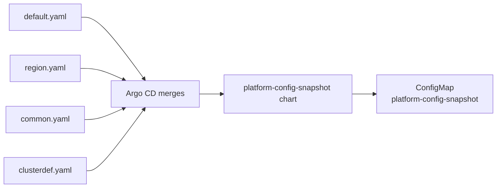

# platform-config-snapshot

Writes a single `ConfigMap` to each cluster containing the **fully merged platform-config values** — all four layers combined into one place. Any engineer can inspect exactly what configuration is in effect without having to mentally merge files from Git.

## How it works

Argo CD renders this chart using the same multi-source `valueFiles` chain as every other platform app. By the time the chart is rendered, Argo CD has already merged all four layers, so the chart simply serialises `.Values` into a ConfigMap.



## Reading the snapshot on a cluster

```bash
# View the merged values for the current cluster
oc get configmap platform-config-snapshot -n openshift-gitops -o jsonpath='{.data.values\.yaml}'

# Pretty-print with yq
oc get configmap platform-config-snapshot -n openshift-gitops -o jsonpath='{.data.values\.yaml}' | yq
```

## Labels and annotations

| Key | Value | Purpose |
|-----|-------|---------|
| `platform/config-snapshot` | `"true"` | Identifies snapshot ConfigMaps across clusters |
| `platform/cluster-type` | e.g. `dev` | Matches `clusterType` from platform-config |
| `platform/cluster-group` | e.g. `digital` | Matches `clusterGroup` from platform-config |
| `platform/readonly` | `"true"` | Signals that manual edits will be reverted |
| `platform/layers` | merge chain | Documents the four files that produced this snapshot |

The ConfigMap is **read-only by convention** — Argo CD will revert any manual edits on next sync.

## Local render (dry-run)

```bash
helm template snapshot . \
  -f ../../../platform-config/default.yaml \
  -f ../../../platform-config/clusters/dev/common.yaml \
  -f ../../../platform-config/clusters/dev/digital/clusterdef.yaml
```
